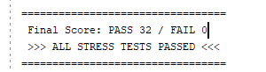
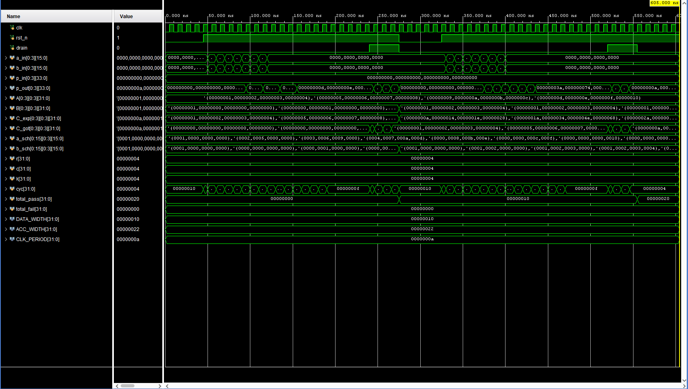
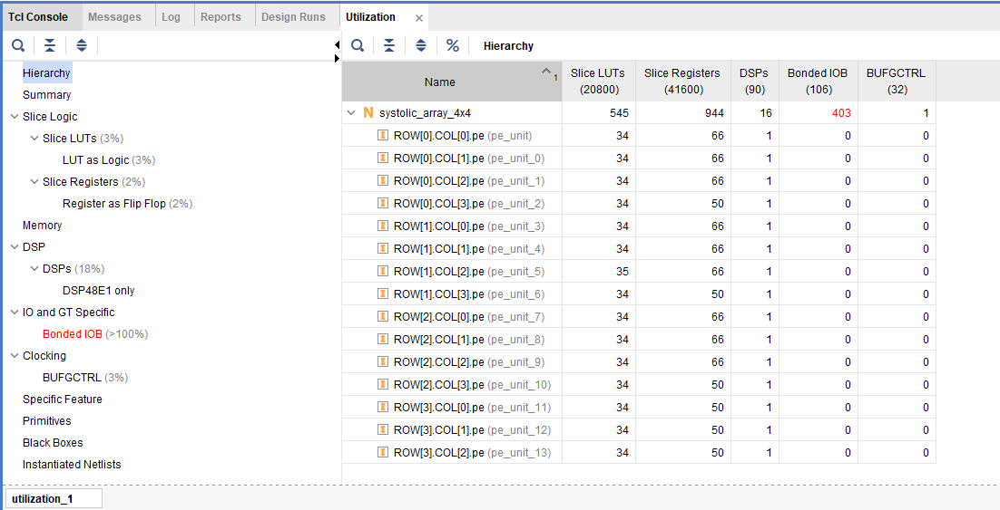
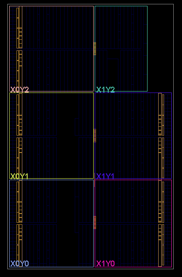

#  4x4 Output-Stationary Systolic Array AI Accelerator

## Overview
This project implements a 4x4 systolic array-based AI accelerator core designed for Xilinx Artix-7 FPGAs (`xc7a35tcpg236-1`). Moving to a simple functional model, my focus was on hardware-level optimization: forcing dedicated DSP slice inference, resolving pipeline latency, and managing data skew scheduling.

##  Architecture & Dataflow
The core consists of 16 Processing Elements (PEs) performing signed Multiply-Accumulate (MAC) operations: $C(i, j) = A(i, k) \times B(k, j) + \text{PartialSum}$

- **Architecture:** Output-Stationary (OS) mesh grid.
- **Pipeline:** 2-stage structure. Multiplication results land in `mult_reg` first (Stage 1), then accumulate into `c_reg` (Stage 2). 
- **Control Flow:** Dedicated `drain` logic manages the sequential, vertical flush of accumulated results after the computation cycles.

---

## 🛠️ Where I Got Stuck (The Debugging Journey)

Building this involved a lot of back-and-forth with Vivado. Here is how I solved the core engineering challenges:

### 1. DSP Inference (LUT 1,392 → 513)
My original version used INT8 unsigned data. I added the `(* use_dsp = "yes" *)` attribute and thought that would be enough. It wasn't—Vivado mapped everything to ~1,392 LUTs instead.
* **The Fix:** I learned that small unsigned multiplications often don't meet the DSP48E1 inference threshold. I switched to **INT16 signed** arithmetic and explicitly separated the multiply into its own 1-cycle pipeline register (`mult_reg`). 
* **Result:** 16 DSP slices mapped exactly 1:1 per PE, and LUT count dropped by nearly 80%.

### 2. X-Propagation in Simulation
Early waveforms came out completely contaminated with `XXXX`. I realized `mult_reg` had no reset path, so the very first clock cycle was accumulating uninitialized `X` values into `c_reg` that never flushed out.
* **The Fix:** Added explicit `rst_n` coverage to `mult_reg` and rewrote the testbench to apply a **"Zero-Flush"** strategy (driving 0s to all inputs and schedule arrays) before injecting real data. 

### 3. Skew Scheduling & Drain Timing Alignment
After adding the pipeline register, my testbench was sampling results one cycle too early, leading to `FAIL 16` errors despite the waveform looking mathematically correct.
* **The Fix:** I had to implement precise **Skew Scheduling** for the input matrices to match the data flow, and crucially, align the `drain` assertion exactly with the OS vertical shift latency. The accumulator produces the value one cycle later, so adjusting the testbench sampling timing solved the issue perfectly.

### 4. Preventing Accumulator Overflow (34-bit Expansion)
* **The Fix:** Multiplying two 16-bit signed integers creates a 32-bit product. Accumulating this across 4 MAC cycles risks exceeding the 32-bit limit. I calculated the safe width (`32 + ceil(log2(4)) = 34`) and parameterized `ACC_WIDTH` to **34 bits**, ensuring zero overflow risk.

### 5. Physical Constraints (IOB Limit)
Running full Implementation failed with a Bonded IOB error (design needs ~259 pins, 35T has ~106). This is expected for an IP block like this, which should sit inside an SoC wrapper/AXI interface. I verified architectural integrity via **Out-of-Context (OOC) Synthesis** and Floorplan view instead.

---

##  Functional Verification
Verified using a custom self-checking stress testbench evaluating Identity and Dense matrix multiplications.
* **Result:** **PASS 32 / FAIL 0** (100% computational accuracy)

### Waveform
Shows exact skew scheduling timing, zero-flush initialization (no X-propagation), and sequential drain output.

---

## 📊 Synthesis Results & Floorplan

| Resource | Used | Note |
| :--- | :--- | :--- |
| **DSP48E1** | 16 | Exactly 1 allocated per Processing Element. |
| **Slice LUTs** | 513 | Down from ~1,392 after DSP mapping fix. |
| **Slice Registers** | 904 | Used for pipeline & accumulation stages. |
| **Bonded IOB** | 387 | Exceeds 35T limit → OOC synthesis utilized. |

### DSP Mapping Floorplan
The layout below confirms the successful 1:1 mapping of the 16 Processing Elements to the dedicated **DSP48E1 slices** (highlighted in orange). Seeing this physical placement was the moment the design truly felt real.

---

##  What's Next
- Add timing report (Fmax, critical path slack) documentation.
- Implement an AXI-Lite wrapper for SoC integration.
- Parameterize the array size (currently hardcoded 4x4).
- Redesign drain logic to sequence per-row instead of a single shared signal.

---
**Aaron Choi** | Lehigh University, Electrical Engineering (Class of 2029)
